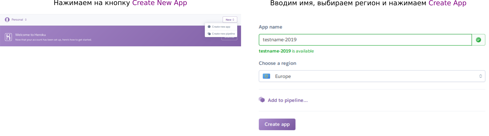
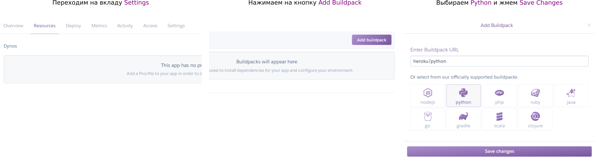
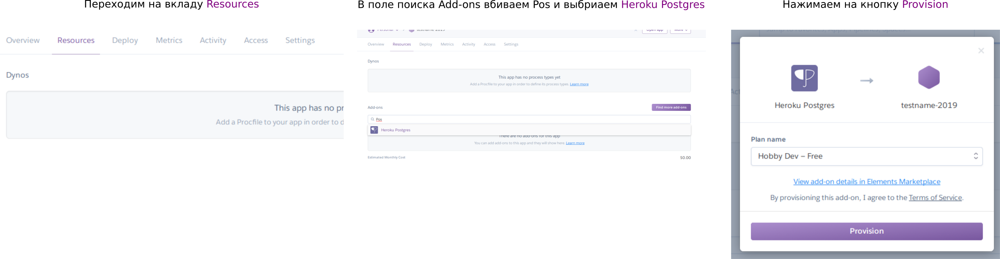
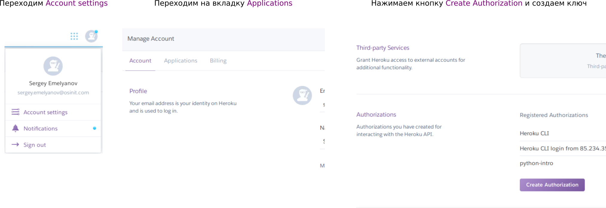
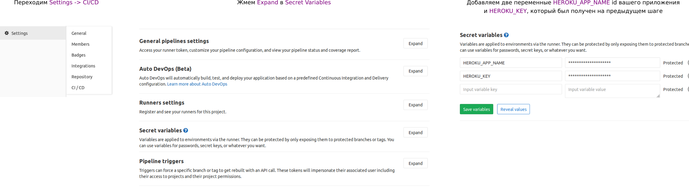

## Данный manual позволит развернут ваше приложение на heroku
**ВАЖНО!!!** если у вас есть какие-то вопросы или возникают, ставьте статус задаче `Требуется информация`
и пишите в комментарии, желательно с log ошибки.

### 1. Создание ветки
Вам надо создать ветку release и делать все изменения в ней. 

### 2. Настройка heroku
* Регистрируемся на [heroku](https://heroku.com)
* Создаем приложние (имя выбираете сами)



---
* Устанавливаем тип



---
* Добавялем БД


---

* Получаем ключ


---

Если в процессе возникают вопросы в первую очередь обращайтесь к документации
и только если все совсем плохо спрашивайте
### 3. Настройка переменных CI


### 4. Настройка settings
Надо скопировать `heroku_settings.py.tpl` в этой же папке как `heroku_settings.py`

В ALLOWED_HOSTS надо поставить domain name вашего приложения
```python
ALLOWED_HOSTS.append('testname-2019.herokuapp.com')
```

### 5. Добавление дополнительных view
1. Для того чтобы frontend разработчики могли изучать ваше приложение надо добавить
swagger, [библиотека](https://github.com/axnsan12/drf-yasg) для это необходимая уже есть в `requirements`.
Вам надо только настроить для нее swagger доступный по `path` `/api/v1/swagger`.
2. Надо добавить view для получения списка доступных категорий `/api/v1/categories`

Все необходимые фикстуры добавляются при старте приложения, credentials от админки `admin:admin`. Там
вы можете добавить токен для вашего manager `osinit` и проверить приватные API


